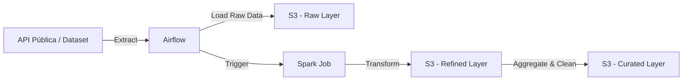

# 🚀 Data Pipeline com Airflow + Spark + S3

Este projeto demonstra a construção de um pipeline de dados moderno utilizando **Apache Airflow** para orquestração, **Apache Spark** (**PySpark**) para processamento distribuído e **Amazon S3** (ou MinIO em ambiente local) como Data Lake. O objetivo é implementar um fluxo **ETL (Extract, Transform, Load)** completo, organizando os dados em camadas de um Data Lake (Raw → Refined → Curated).

-----

### 📌 Arquitetura do Projeto



### ⚙️ Tecnologias Utilizadas

  * Python 3.10+
  * Apache Airflow
  * Apache Spark / PySpark
  * Amazon S3
  * Docker + Docker Compose

-----

### 📂 Estrutura do Repositório


📂 data-pipeline-airflow-spark
 ┣ 📂 dags              # DAGs do Airflow
 ┣ 📂 spark_jobs        # Scripts PySpark
 ┣ 📂 data              # Exemplos de dados
 ┣ 📂 docs              # Diagramas e prints
 ┣ docker-compose.yml   # Subir ambiente Airflow + Spark + MinIO
 ┣ requirements.txt     # Dependências
 ┗ README.md            # Este arquivo
```

-----

### ▶️ Como Executar

#### **1. Clonar o repositório**

```bash
git clone https://github.com/bcamera/data-pipeline-airflow-spark.git
cd data-pipeline-airflow-spark
```

#### **2. Subir os containers**

```bash
docker-compose up -d
```

#### **3. Acessar o Airflow**

  * **UI:** http://localhost:8080
  * **User:** `airflow` | **Password:** `airflow`

#### **4. Executar a DAG**

Habilite a DAG `etl_pipeline` na interface do Airflow.

-----

### 📊 Exemplo de Fluxo ETL

  * **Extract:** Coleta dados de exemplo (ex.: COVID-19 Data ou Yahoo Finance).
  * **Load Raw:** Salva os dados brutos no bucket `raw/`.
  * **Transform (Spark):** Limpeza e agregação.
  * **Load Curated:** Salva dados prontos para consumo em `curated/`.

-----

### 📌 Próximos Passos

  * Implementar DAG inicial de ingestão.
  * Criar job PySpark de transformação.
  * Integrar com S3 (ou MinIO local).
  * Adicionar monitoramento de falhas no Airflow.

-----

### ✨ Autor

  * 👨‍💻 Bruno Camera
  * 💡 Analista de Banco de Dados em transição para Engenharia de Dados & IA
